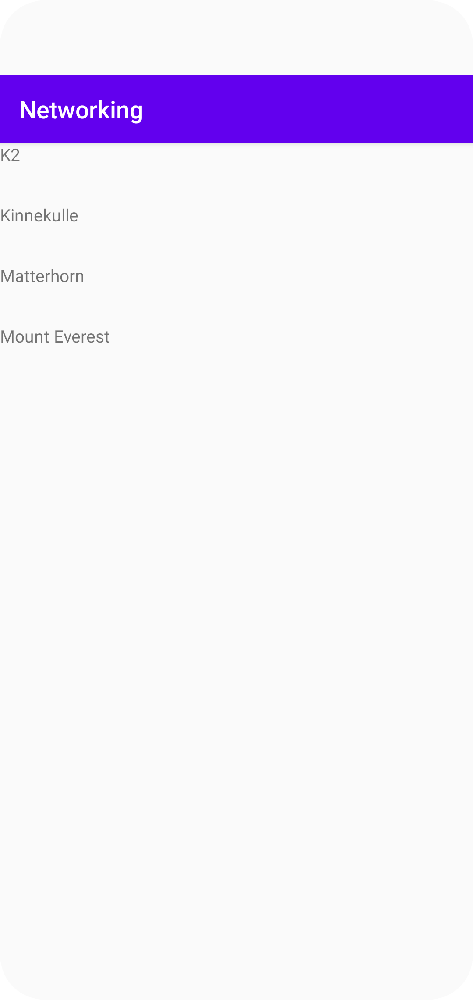

# Rapport


I started the assignment by first removing the existing textView in activity_main.xml file so that it only holds a recyclerView in it.
The textView template is implemented in a separate file that i named list_items which will represent the mountain names that will show as a list in the recyclerview.

activity_main.xml file:

```
 <androidx.recyclerview.widget.RecyclerView
        android:id="@+id/recycler_view"
        android:layout_width="match_parent"
        android:layout_height="match_parent"
         />


```
list_items xml file:

```

<TextView
        android:layout_width="match_parent"
        android:layout_height="wrap_content"
        android:id="@+id/text_view1"
        />

```

The second step was to create the mountain class so that we can make an arrayList of mountains and generate setter and getters.
The mountain class in my case only has one member variable which is name. I also have a toString method which is used to represent objects as strings.

```
public class Mountain {

    String name;

    public void setName(String name) {
        this.name = name;
    }

    public String getName() {
        return name;
    }

    @Override
        public String toString() {
            return "Mountain{" +
                    "name='" + name + '\'' +
                    '}';
        }


```

The next step is to Create the adapter class which is a an important part of the assignment. The adapter class is responsible of creating the views for each item
in the recycler_view. It has a couple of methods responsible for different things which i will explain below.

In the constructor of the adapter class we will pass in the ArrayList of mountains, which means that when this class is instansiated we have to provide
it with arrayList items.

```
List<Mountain> mountainList;

    public RecyclerViewAdapter(List<Mountain> mountainList) {
        this.mountainList = mountainList;
    }


```
The adapter class also has an internal class called ViewHolder and this class is responsible for basically holding our view.
The textView is created within this class and linked to the one in the list_items xml file.

```
public class ViewHolder extends RecyclerView.ViewHolder {
        TextView textView;
        public ViewHolder(@NonNull View itemView) {
            super(itemView);
            textView = itemView.findViewById(R.id.text_view1);
        }


```


OnBindViewHolder method in Adapter class handles how the data is shown on the screen. By binding new data to views that disappear from the screen
as you scroll up and down. It recycles the old views by binding new data to it.
To set the text for each row this method needs the position and name of the objects in the mountain arrayList.

```
@Override
    public void onBindViewHolder(@NonNull RecyclerViewAdapter.ViewHolder holder, int position) {
        holder.textView.setText(mountainList.get(position).getName());

    }


```
Lastly in our Adapter class we have the OnCreateViewHolder method, which is used to inflate our view, which basically means to read an xml file.
The xml file we want to inflate in our case is the list_items file and pass in the needed parameters.

```

public RecyclerViewAdapter.ViewHolder onCreateViewHolder(@NonNull ViewGroup parent, int viewType) {
        View view = LayoutInflater.from(parent.getContext()).inflate(R.layout.list_item,parent, false);

        return new ViewHolder(view);
    }


```
In the MainActivity class:

- Created a mountainList array.
- Created a RecyclerView object
- Created a LayoutManager for the recyclerView(decides in which layout our items show)
- instansiated the adapter class
- Set the a LinearLayout for the recycler view
- Set adapter for the recycler view


```
private ArrayList<Mountain> mountainList;
private RecyclerViewAdapter adapter;

mountainList = new ArrayList<>();
        RecyclerView recyclerView = findViewById(R.id.recycler_view);
        LinearLayoutManager linearLayoutManager = new LinearLayoutManager(this);
        adapter = new RecyclerViewAdapter(mountainList);
        recyclerView.setLayoutManager(linearLayoutManager);
        recyclerView.setAdapter(adapter);


```
In the OnPostExecute method i created a gson object to read the json data. Next we need to Unmarshall the json data into objects and then
assign the list of mountains to the gson object. And since we have changed the data in the mountainList by adding the json data we need to update out adapter
to match the changes.

```
Gson gson = new Gson();
        Type type = new TypeToken<List<Mountain>>(){}.getType();
        List<Mountain> tmp = gson.fromJson(json,type);
        mountainList.addAll(tmp);
        adapter.notifyDataSetChanged();


```

Lastly for this assignment i changed JSON class to read data from JSON task class instead of JSON file because we want to read data from the provided URL
for the assignment. Also added internet permissions in the manifest file or an external file would not work.

private final String JSON_URL = "https://mobprog.webug.se/json-api?login=brom";

new JsonTask(MainActivity.this).execute(JSON_URL);




